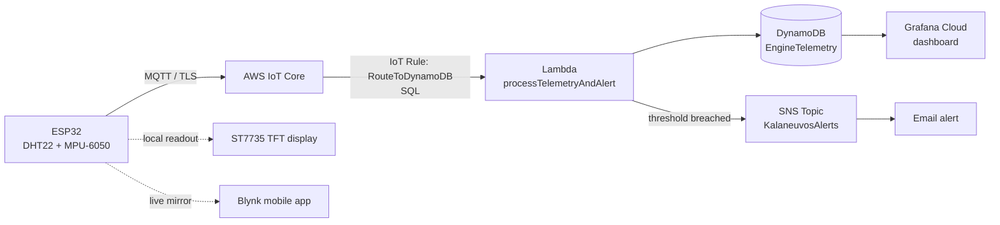

# Kalaneuvos IoT Condition Monitoring

Real-time IoT condition monitoring for Multivac slicing machines at [Kalaneuvos](https://kalaneuvos.fi/), a fish processing factory in Finland. Built as my bachelor's thesis project at Hämeen ammattikorkeakoulu (HAMK), ICT Bioeconomy program.

An ESP32 node reads temperature, humidity, and vibration from a slicing machine, streams it to AWS over MQTT/TLS, and a serverless AWS pipeline persists it and raises an alert on threshold breach, while Grafana visualizes it in real time — giving factory staff early warning of abnormal vibration or temperature before a machine fails.

## Why

Multivac slicing machines run continuously in a cold-chain food processing environment. Unplanned downtime is expensive and hard to diagnose after the fact. This project adds always-on condition monitoring so operators can see machine health live and get notified of anomalies (e.g. abnormal vibration or an out-of-range temperature) before they become failures, instead of relying on manual checks.

## Architecture



The pipeline is serverless end-to-end. An AWS IoT Core rule (`RouteToDynamoDB`) matches messages on the `esp32/telemetry` topic and invokes a Lambda function:

```sql
SELECT "esp32-kalaneuvos-01" as device_id, timestamp() as timestamp,
       temperature, humidity, vibration_x, vibration_y, vibration_z
FROM 'esp32/telemetry'
```

The Lambda function (`lambda/processTelemetryAndAlert`) does two things on every reading: it writes the record to the `EngineTelemetry` DynamoDB table, and it checks the reading against configurable temperature and vibration thresholds — publishing an SNS notification (delivered by email) whenever one is breached. Grafana Cloud queries the `EngineTelemetry` table directly to render live charts.

## Hardware

| Component | Purpose |
|---|---|
| ESP32 dev board | Wi-Fi + compute, publishes over MQTT |
| DHT22 | Temperature & humidity |
| MPU-6050 | 3-axis vibration/acceleration |
| ST7735 TFT (128x160) | Local on-device readout |

## Cloud stack

| Layer | Service |
|---|---|
| Device connectivity | AWS IoT Core (MQTT over TLS, X.509 device certs) |
| Routing | AWS IoT Core Rule (SQL, Lambda action) |
| Processing + alerting | AWS Lambda (`processTelemetryAndAlert`) |
| Storage | Amazon DynamoDB |
| Notifications | Amazon SNS (email) |
| Visualization | Grafana Cloud |
| Secondary live view | Blynk (mobile app mirror of the same telemetry) |

## Repo structure

```
firmware/kalaneuvos_monitor/
  kalaneuvos_monitor.ino   # main sketch: sensors, TFT UI, AWS IoT MQTT client
  Blynk.ino                # Blynk mobile-app telemetry mirror
  secrets.h.example        # template for WiFi/AWS/Blynk credentials (copy to secrets.h)
lambda/processTelemetryAndAlert/
  index.mjs                # writes to DynamoDB, publishes an SNS alert on threshold breach
  package.json             # AWS SDK v3 clients used (bundled in the Lambda Node.js runtime)
sample_data/
  sample_telemetry.csv     # synthetic sample matching the real schema (not factory data)
```

## Running it yourself

1. Open `firmware/kalaneuvos_monitor/` in the Arduino IDE.
2. Copy `secrets.h.example` to `secrets.h` in the same folder and fill in:
   - your Wi-Fi SSID/password
   - an AWS IoT Core "Thing" endpoint, device certificate, and private key (AWS IoT Core → Manage → Things)
   - your Blynk template ID/name and auth token (optional — only needed for the mobile mirror)
3. Create a DynamoDB table with partition key `device_id` (String) and sort key `timestamp` (Number).
4. Create an SNS topic and subscribe your email to it.
5. Deploy `lambda/processTelemetryAndAlert/index.mjs` as a Lambda function (Node.js runtime). Give its execution role `dynamodb:PutItem` on the table and `sns:Publish` on the topic. Set environment variables `TABLE_NAME`, `SNS_TOPIC_ARN`, `VIBRATION_THRESHOLD`, `TEMP_MAX_C`, `TEMP_MIN_C`, and `TEMP_CALIBRATION_OFFSET_C` (added after on-site testing showed the DHT22 reading ~3°C above a factory reference thermometer; set to the signed correction your own sensor needs, e.g. `-3`, or `0` if your sensor is already accurate).
6. In AWS IoT Core, create an IoT Rule on topic `esp32/telemetry` with a Lambda action pointing at that function.
7. Point a Grafana (Cloud or self-hosted) DynamoDB data source at the table.
8. Flash the ESP32 and power it on — the on-device screen shows live readings immediately; DynamoDB, the dashboard, and (if a threshold is breached) an email alert all update within seconds.

`secrets.h` is gitignored, so your real credentials never get committed.

## Status

In active implementation and debugging as of thesis coursework running June–December 2026. Approved by Kalaneuvos as a real deployment target.

## License

MIT — see [LICENSE](LICENSE).
